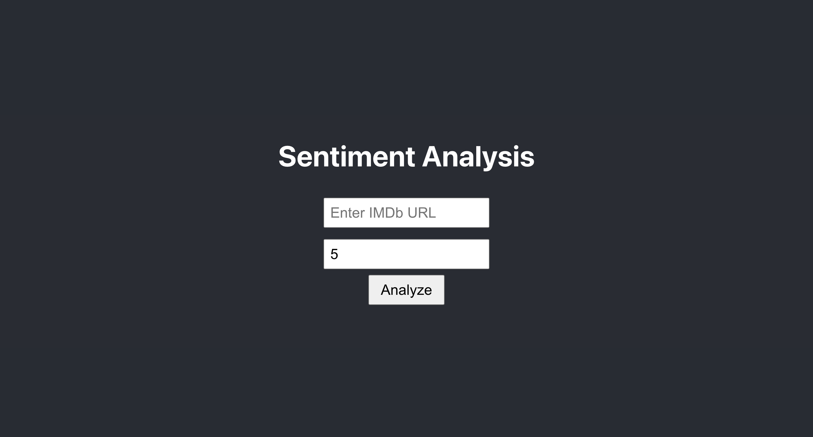
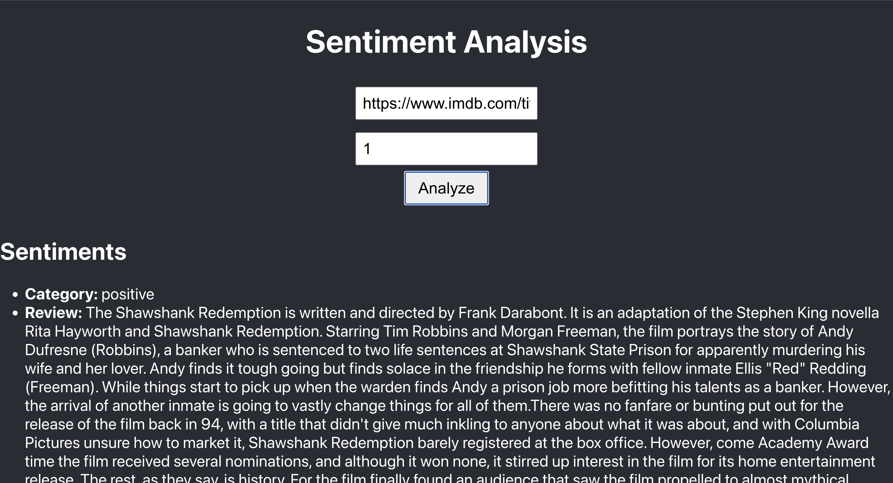
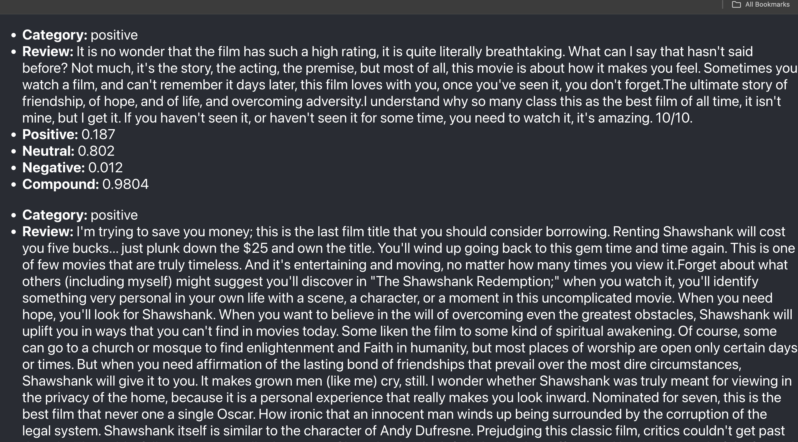
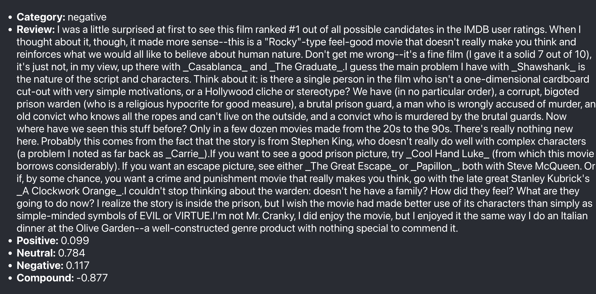

# Movie Review Sentiment Analysis Application

This project is a web application that scrapes movie reviews from IMDb, performs sentiment analysis using AI, and displays the results. The application is built using Flask for the backend and React for the frontend.

## Table of Contents

- [Overview](#overview)
- [Requirements](#requirements)
- [Setup Instructions](#setup-instructions)
- [Running the Application](#running-the-application)
- [How It Works](#how-it-works)
- [Deployment](#deployment)
- [Troubleshooting](#troubleshooting)

## Overview

The Movie Review Sentiment Analysis Application performs the following tasks:

1. **Scrapes Movie Reviews**: Uses BeautifulSoup to scrape reviews from IMDb.
2. **Analyzes Sentiment**: Applies NLTK's VADER sentiment analysis to the scraped reviews.
3. **Displays Results**: Presents the reviews and their sentiment scores through a React frontend.

## Requirements

- Python 3.8 or later
- Node.js 14.x or later
- Pip (Python package installer)
- npm (Node package manager)

## Setup Instructions

### Backend Setup

1. **Navigate to the `backend` directory**:

   ```sh
   cd backend
   ```

2. **Create and activate a virtual environment**:

   ```sh
   python -m venv venv
   source venv/bin/activate  # On Windows, use `venv\Scripts\activate`
   ```

3. **Install Python dependencies**:

   ```sh
   pip install -r requirements.txt
   ```

4. **Run the Flask server**:
   ```sh
   python app.py
   ```

### Frontend Setup

1. **Navigate to the `frontend` directory**:

   ```sh
   cd frontend
   ```

2. **Install Node.js dependencies**:

   ```sh
   npm install
   ```

3. **Start the React development server**:
   ```sh
   npm start
   ```

## Running the Application

1. **Start the Flask backend**: Ensure the Flask server is running on `http://127.0.0.1:5000`.

2. **Start the React frontend**: Ensure the React app is running on `http://localhost:3000`.

3. **Open your browser** and navigate to `http://localhost:3000` to use the application.

4. **Enter an IMDb movie URL** and specify the number of pages to scrape. Click on "Analyze" to fetch reviews and display sentiment analysis results. URL Example: https://www.imdb.com/title/tt0111161/



The result







## How It Works

1. **Web Scraping**:

   - **BeautifulSoup** is used to parse and extract reviews from IMDb movie pages.
   - Reviews are collected by handling pagination through multiple pages.

2. **Sentiment Analysis**:

   - **NLTK's VADER** sentiment analysis tool evaluates the sentiment of each review.
   - The sentiment analysis provides scores for positive, neutral, negative, and compound sentiment.

3. **Integration**:
   - The Flask backend handles requests for scraping and sentiment analysis.
   - The React frontend sends requests to the Flask server and displays the results.
